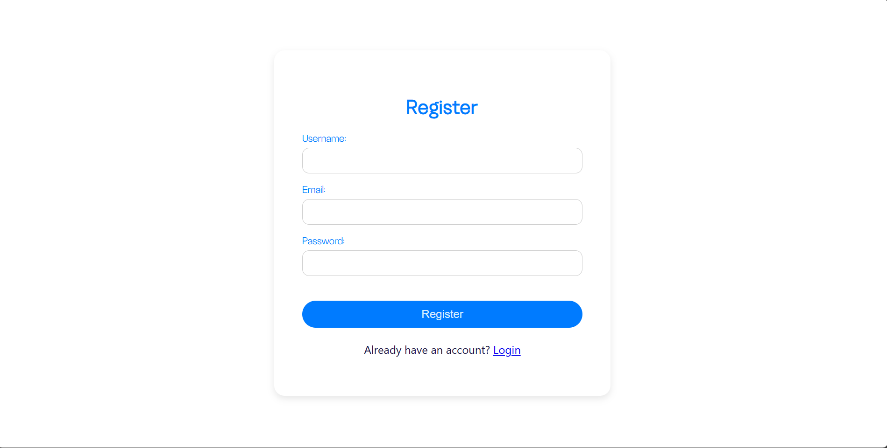

# My Favorite Novel

## Описание

**Yandex Disk Downloader** — это веб-приложение для скачивания файлов по публичной ссылке Яндекс Диска. Сервис позволяет просматривать файлы по ссылке и скачивать их.
## Особенности

- **Просмотр файлов**: Удобный интерфейс для просмотра всех доступных файлов.
- **Скачивание файлов**: Сервис позволяет скачивать файлы как по одному, так и по несколько файлов одновременно.
- **Фильтрация файлов**: Пользователь имеет возможность фильтровать файлы по типам.

## Структура проекта

- **backend/**: Серверная часть, написанная на Django, отвечает за API и логику обработки данных.
- **frontend/**: Клиентская часть на React, предоставляет интерфейс для взаимодействия с пользователем.
- **api/views.py**: Представления, обеспечивающие обработку запросов к API для работы с файлами.
- **serializers.py**: Сериализаторы для преобразования данных между Python-объектами и форматами JSON.

## Установка

### 1. Клонирование репозитория

```bash
git clone https://github.com/Polina-Solovyova/YandexDiskTask.git
cd YandexDiskTask
```
### 2. Установка зависимостей
#### Backend

```bash
cd backend
pip install -r requirements.txt
python manage.py migrate
```

#### Frontend
```bash
cd frontend
npm install
```

### 3. Запуск проекта
#### Backend


```bash
cd backend
python manage.py runserver
```
#### Frontend

```bash
cd frontend
npm start
```

## Использование
1. Зарегистрируйтесь или войдите в систему. 
2. Введите публичную ссылку на файлы.
3. Выберите файлы для скачивания. 
4. Файлы будут загружены на ваше устройство.
### Пример использования
1. Регистрация и авторизация

Для работы с сервисом пользователю необходимо авторизоваться в системе. Страница авторизации открывается по умолчанию. Чтобы зарегистрироваться в сервисе, нужно нажать на кнопку «Регистрация», которая находится в правом нижнем углу.


После этого необходимо указать свой e-mail адрес (нельзя создать несколько аккаунтов с одним и тем же e-mail), создать уникальное имя пользователя и пароль длиной от 8 до 128 символов. Затем нажмите на кнопку «Зарегистрироваться».




Если регистрация прошла успешно, автоматически откроется окно авторизации. Для входа в сервис укажите своё имя пользователя и пароль, а затем нажмите на кнопку «Войти».

2. Ввод ссылки

Чтобы получить файлы введите в поисковую строку нужную ссылку и нажмите кнопку «Получить файлы». 

На экране появятся файлы доступные по ссылке. Файлы можно получить в виде списка или в виде плитки, так же файлы можно отфильтровать по типам. Если ссылка не существует или не валидная, то на экране высветится сообщение об ошибке.


3. Скачивание файлов

Для скачивания файла нажмите на блок файла. Если вы хотите выбрать несколько файлов, выберите файлы с помощью флажков и нажмите кнопку «Скачать». Так же есть возможность выбрать все файлы или снять все флажки.

Файлы будут загружены на ваше устройство.


Возможность скачивания файлов в формате zip и скачивание папок находится в разработке.

## Требования
- Python 3.11+
- Django 5.0.7+
- Node.js 14+
- npm 10.8.2+
- React 17+